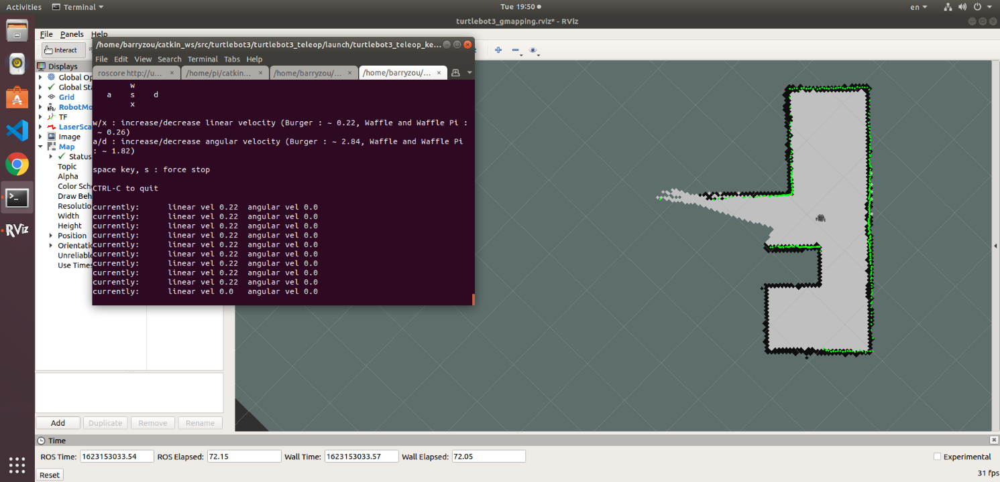
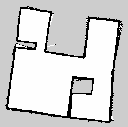
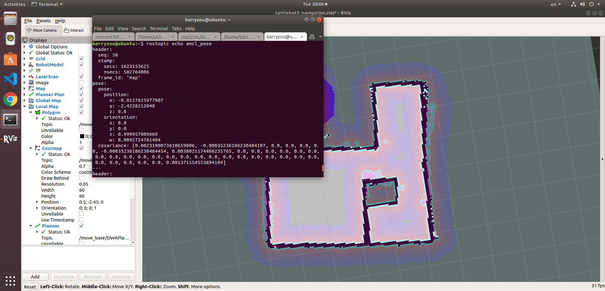
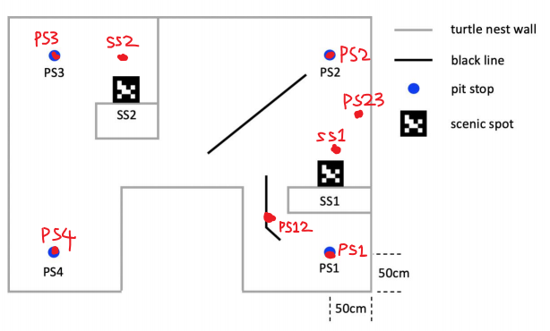
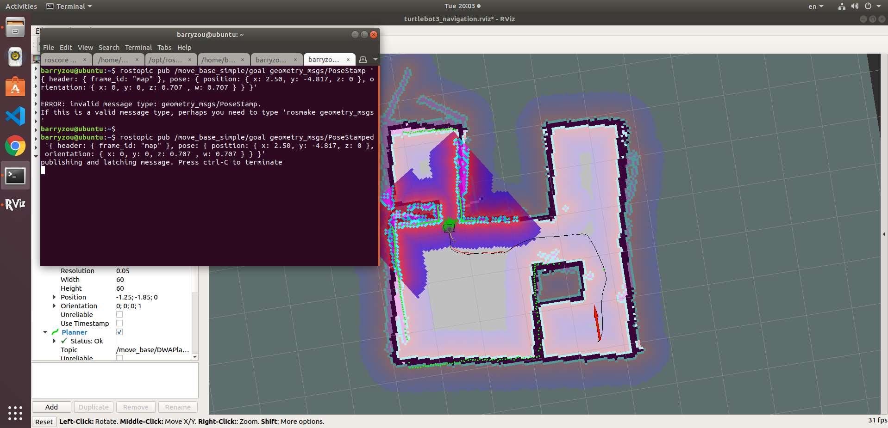
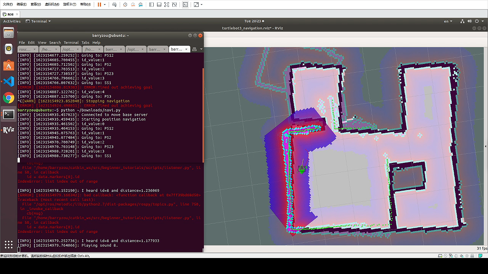
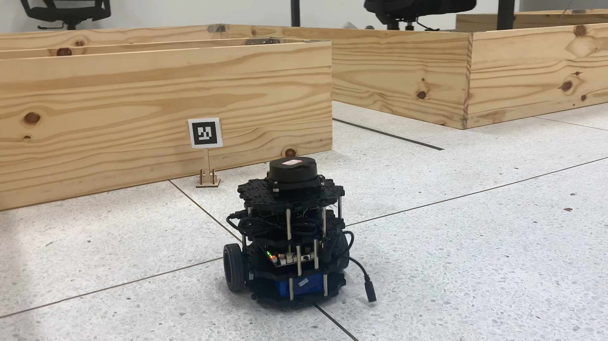
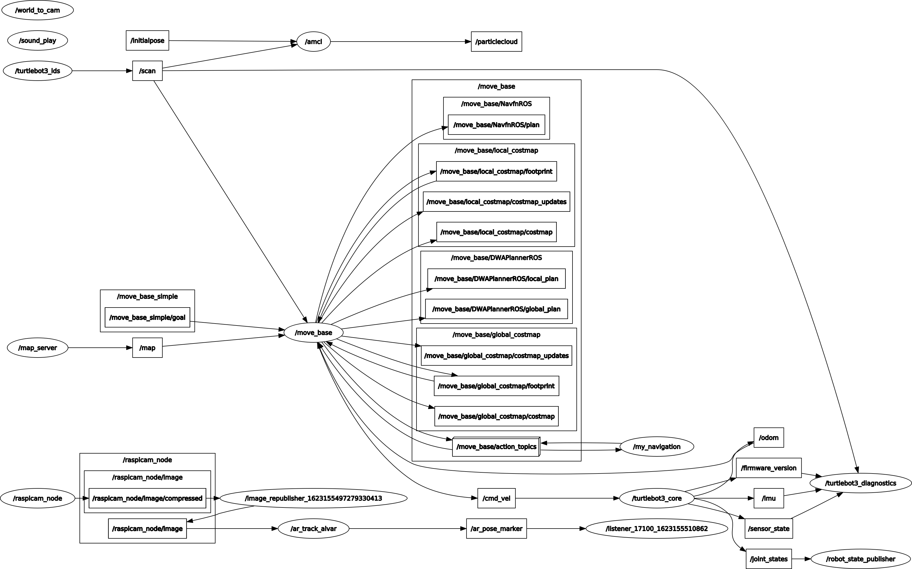

# Solution to capstone lab of EE346
## Haoyu Zou, Cheng Lin

Github repository link: https://github.com/BarryZou/EE346-Capstone-Project

### Intro

In previous courses and labs, we learned and practiced the mapping and navigation functions of Turtlebot3 on the official ROS packages. With these skills mastered, we are asked to implement several navigation tasks as the first event of the final capstone lab. The lab requires our robots to walk around in a pre-mapped environment and complete a list of tasks including parking precisely and scene (ar code) recognition. Both of the tasks are typical jobs in autonomous driving, and the combination of them forms a time-limited competition which is another event of the capstone lab.

Our solution to both events can be divided into four steps, mapping, localization, planning and navigation. Each step will be introduced in the following sections.

### Mapping

Since the project is not a SLAM project, it is allowed to pre-built the map of the field which can help a lot in localization and navigation steps. The LiDAR module of Turtlebot3 is used in this step to provide us with the depth information of the field, combining it with the odometry data from the robot will help estimate the location of robot and construct a 2-D occupancy grid map.

During this step, the official `turtlebot3_slam` and `turtlebot3_teleop` packages are used to initial mapping and controlling of Turtlebot3 through keyboard. Specifically, the following commands are used.

- Launch mapping program
  ```
  roslaunch turtlebot3_slam turtlebot3_slam.launch
  ```
- Use keyboard to control Turtlebot3
  ```
  roslaunch turtlebot3_teleop turtlebot3_teleop_key.launch
  ```

<div>
<br />
<div>Fig.01 -- GMapping with keyboard operation</div>
</div>

The occupancy grid map will be shown in RViz, in which grey stands for unknown grid, black stands for occupied grid, and white stands for free grid. After the mapping process finished, the following command is used to save the map as an image together with the parameters of it.

- Saving built map
  ```
  rosrun map_server map_saver -f ~/capstone
  ```

<div>
<br />
<div>Fig.02 -- Saved map</div>
</div>

### Localization

In order to finish the given tasks, we need to set a number of waypoints in the navigation program. But before that, obtaining the precise coordinates of these waypoints is necessary for setting navigation goals. The robot implements AMCL (Adaptive Monte Carlo Localization) to locate itself in the field with given map, you can refer to the details of AMCL algorithm through the URL given below.

- ROS wiki of AMCL: http://wiki.ros.org/amcl

In ROS, we can use the following command to obtain the estimated current location of Turtlebot3 which is published in topic `amcl_pose`.

- Obtaining AMCL coordinates
  ```
  rostopic echo amcl_pose
  ```

<div>
<br />
<div>Fig.03 -- AMCL</div>
</div>

To finish the task of parking at 3 pit stops and visiting 2 scene spots, we plan to record 8 waypoints, which are shown in the folloing graph and will be explained later. For PS1~PS4, we need to collect their accurate position, while for SS1 and SS2, we calibrate the robot 1 meter away from them.

<div>
<br />
<div>Fig.04 -- Task and waypoints</div>
</div>

### Planning

In the first event, our drone is asked to finish task PS1, PS2, SS1, PS3, SS2, PS4 in order. Our previous experiments showed that the robot may perform better if some additional waypoints are used to assist the route planning, so we add extra waypoints "PS12" and "PS23" (shown in Figure 4 above) to help the robot plan its way better, and the final route should be PS1-PS12-PS2-PS23-SS1-PS3-SS2-PS4.

In the second event, we will start from PS1 and have 3 minutes to finish every two tasks in different region (left / right) of the field, so route planning becomes quite important as points are gained by the number of tasks done. The optimized task groups should be {PS2, SS1} - {PS3, SS2}, so 2 tasks can be done by visiting each region. After several trials, we found that when it's almost impossible to finish group {PS3, SS2} the second time, as a lot of time is wasted in the short path from PS2 to SS1. The optimized route became SS1-PS2-PS3-SS2-SS1-PS3-SS2 after our design, such that a maximum of 7 tasks can be done. Although we failed to finish all of them in the game, the optimization of path is still inspiring.

As for each type of task, the navigation package we used `move_base` can stop the robot after it reach each waypoint, so it's easy to stop at each pit stop (while the accuracy is still not guaranteed). The ROS package `ar_track_alvar` is used to recognize ar code provided by the camera on Turtlebot3, and after each recognition, it will publish information to topic `ar_pose_marker`, which is subscribed by another node "listener" designed by ourselves. This node provides the ability of playing sound using package `sound_play`.

### Navigation

After planning the route and the method to finish each task, we can now begin the final step. Notice that the navigation package `move_base` we used accepts goals through topics, so simply publishing the pose information of waypoints to topic will work.

<div>
<br />
<div>Fig.05 -- Publishing goals</div>
</div>

After these attempts, we found that the process of publishing goals can be done by a Python script, which also allow us to park the robot at certain waypoint. The navigation scripts of both events are attached in folder `/scripts`, named as `navi.py` and `task.py` respectively.

Here comes the complete commands and procedures of navigation.

- Starting the ROS service on PC
  ```
  roscore
  ```

- Starting the image topic republisher on PC
  ```
  rosrun image_transport republish compressed in:=/raspicam_node/image raw out:=/raspicam_node/image
  ```

- Connecting to the Raspberrypi (2 terminals needed)
    
  Remember to configure `/etc/hosts` on both PC and turtlebot
  ```
  sshpass -p turtlebot ssh pi@raspberrypi
  ```

- Initializing camera on raspberrypi
  ```
  roslaunch raspicam_node camerav2_410x308_30fps.launch
  ```
- Bringup Turtlebot
  ```
  roslaunch turtlebot3_bringup turtlebot3_robot.launch
  ```

- Run the ar tag recognizing node on PC
  ```
  roslaunch ar_track_alvar test.launch
  ```

- Initialize the sound play node
  ```
  rosrun sound_play soundplay_node.py
  ```

- Run listener node that make sound for recognition
  ```
  rosrun beginner_tutorials listener.py 
  ```

- Ready the turtlebot

- Start RViz and load pre-built map
  ```
  roslaunch turtlebot3_navigation my_navigation.launch map_file:=$HOME/capstone.yaml
  ```
- Start navigation (or task) script

  ```
  python navi.py
  python task.py
  ```

Then the Turtlebot3 will follow our set route and finish all the tasks.

<div>
<br />
<div>Fig.06 -- Navigating and visiting Scene Spot 1</div>
</div><br />

<div>
<br />
<div>Fig.07 -- Turtlebot3 finishing tasks</div>
</div>

The complete video clips are attached in folder `/videos`.

<div>
<br />
<div>Fig.08 -- Overall system structure</div>
</div>


<style type="text/css">
div{
  text-align: center;
}
div>div {
  text-align: center;
  border-bottom: 1px solid #d9d9d9;
  display: inline-block;
  padding: 2px;
}
div>img{
  border-radius: 0.3125em;
  box-shadow: 0 2px 4px 0 rgba(34,36,38,.12),0 2px 10px 0 rgba(34,36,38,.08);
}
</style>